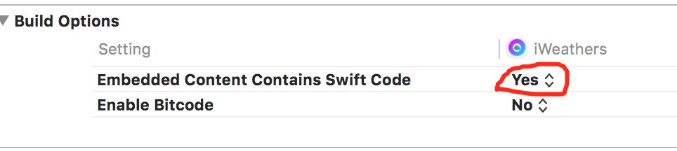
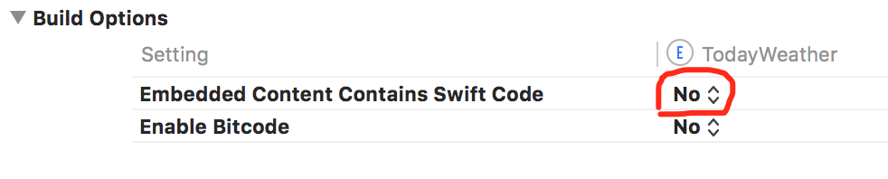
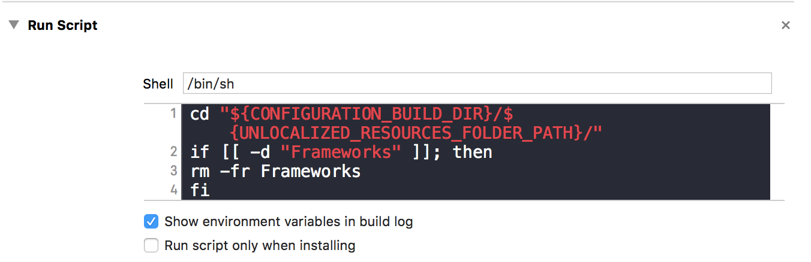
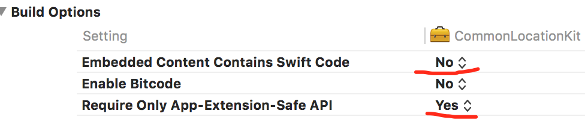

# Today挂件,container app 打包上架问题
1.在containerAPP内build setting里面设置

2.在Today extension内设置

3.在Today extension内build phases新增run scrip

<http://stackoverflow.com/questions/30361864/invalid-bundle-the-bundle-contains-disallowed-nested-bundles-contains-disallow>
3. 在自定义内的framework设置

4. 还一个问题支持ipad的话,,必须支持多方向屏幕

