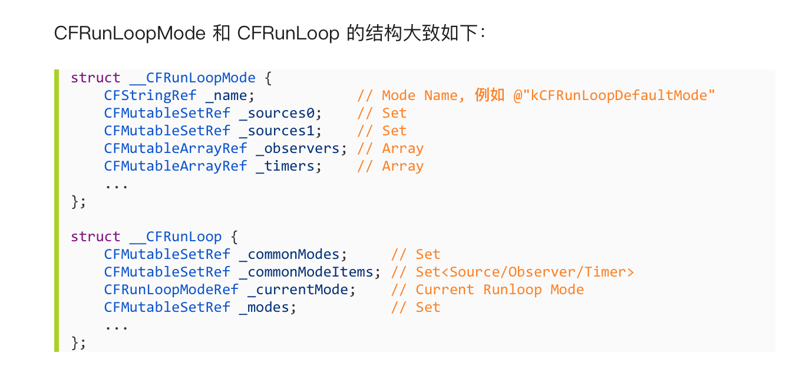
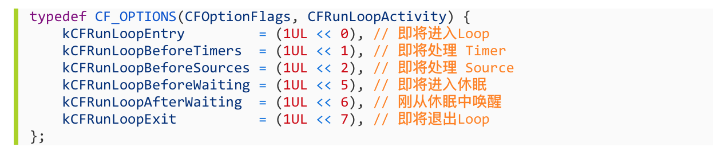

# RunLoop和线程的关系
1,线程和runloop之间是一一对应的,其关系是保存在一个全局的Dictionary里面
2, 线程刚创建时并没有RunLoop,如果你不主动获取,它一直都不会有
3,RunLoop的创建时发生在第一次获取时, RunLoop的销毁时发生在线程结束时
4,你只能在一个线程内部获取其RunLoop(主线程除外)

# Runloop与Mode
1, 一个Runloop包含若干个Mode,每一个Mode又同时包含若干个source/Timer/Observer
2, 每次调用Runloop的主函数时,只能指定其中一个Mode,称为CurrentMode
3,如需要切换Mode只能退出Loop,再重新指定一个Mode进入,这样做主要是为了分隔开不同组的source/Timer/Observer,让其互不影响

# CFRunLoopSourceRef 与 事件
1, CFRunLoopSourceRef是事件产生的地方
2, source有两个版本:source0 和 source1
3, source0 只包含一个回调(函数指针),并不触发事件,必须通过先调用CFRunLoopSourceSignal(source),将这个source标记为待处理,手动调用CFRunLoopWakeUp(runloop)唤醒Runloop
4, Source1 包含了一个 mach_port 和一个回调（函数指针），被用于通过内核和其他线程相互发送消息。这种 Source 能主动唤醒 RunLoop 的线程，其原理在下面会讲到。

# CFRunLoopTimerRef 和 NSTimer
1, CFRunLoopTimerRef 是基于时间的触发器, 它和NSTimer是toll-free-bridge的,可以混用, 其中包含一个时间长度和一个回调(函数指针)
2, 当其加入到Runloop时, Runloop会注册对应的时间点, 当时间点到时, Runloop会被唤醒以执行那个回调

# CFRunLoopObserverRef 与 观察者
1, CFRunloopObserverRef是观察者
2, 每个Observer都包含一个回调函数,当Runloop的状态发生改变时,观察者就能通过回调接受到这个变化
3, 可以观测的时间点有以下几个:

# 上面的source/Timer/Observer被统称为mode item,一个item可以被同时加入多个mode, 但一个item被重复加入同一个Mode是不会有效果的,如果一个mode中一个item都没有,则Runloop会直接退出,不会进入循环

