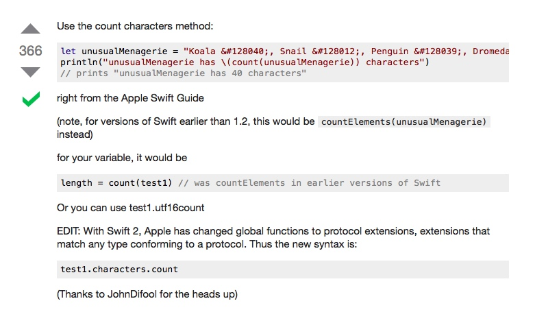

# @property属性特征问题

@property (nonatomic, readwrite, copy) NSMutableString *keyboardString;

由于用了copy关键字导致keyboardString变成不可变字符串,只要把copy改成strong即可

# swift 获取字符串的长度

 
 http://stackoverflow.com/questions/24037711/get-the-length-of-a-string

