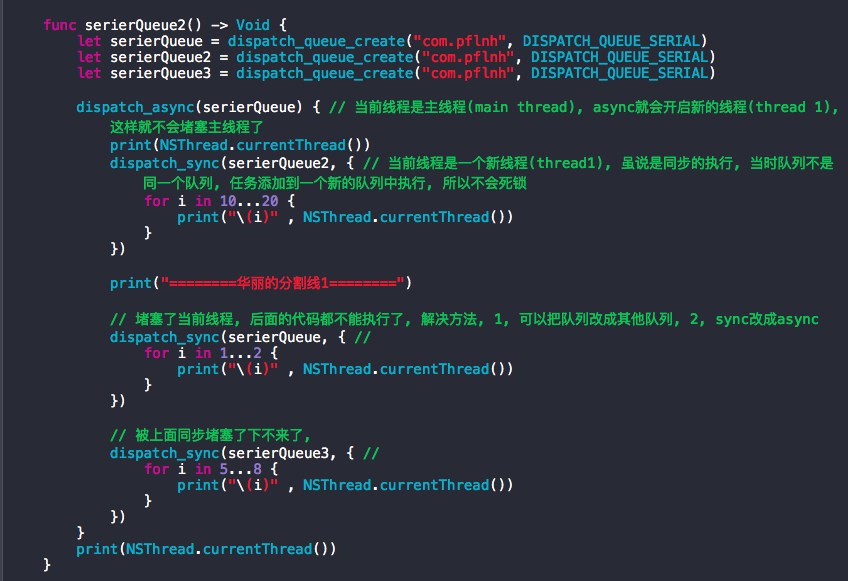
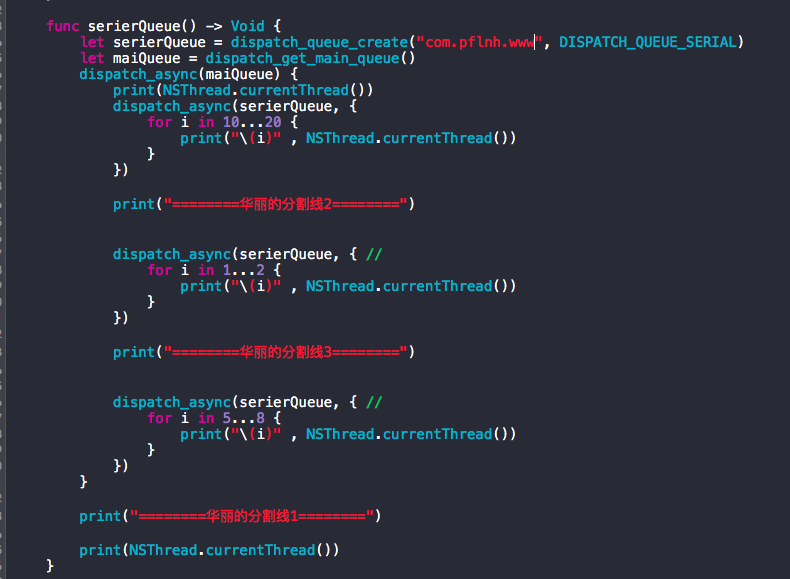

# 关于GCD的理解

一, dispatch_get_main_queue
1, 只有一个主线程, 只能用dispatch_async将任务添加到主线程, 用 dispatch_sync将会死锁
2, 用dispatch_async将任务添加到主线程后, 只有当前任务或者方法(一般为block)执行完后, 才会按照FIFO(先进先出)执行其他任务

print 如下: hello swift
hello
swift
1 2 10 11 12 13 14 15 16 17 18 19 20


二, dispatch_get_global_queue
1, 提供了四种全局队列: low, high, default, background, 一般默认选择default就够了
2, dispatch_sync不会堵塞线程,也不会开辟新的线程, 只会在当前线程, 按照FIFO将任务从队列(queue)中取出逐一执行
3, dispatch_async不会堵塞线程,根据cup实际情况会开辟新的线程, 按照FIFO将任务从队列(queue)中取出异步执行

三, 自定义队列
1, 串行队列
1.1,  sync

如上图, 堵塞了, 只能打印出主线程信息
最里层的打印被堵塞了, 造成了"死锁", 里面的当前线程是一个同步线程, 在当前serierQueue队列堵塞了
解决这种问题, 可以采取其他措施:
1), 把当前队列改其他队列, 同步执行
2), 把同步sync改async异步执行



1.2, async
异步顺序执行, 不会堵塞当前线



2, 并发队列 
2.1, async  并发异步
	1), 根据系统,可以开辟多个线程异步执行任务
	
		   func concurrentQueue() -> Void {
        let concurrentQueue = dispatch_queue_create("com.pflnh.con", DISPATCH_QUEUE_CONCURRENT) 
        dispatch_sync(concurrentQueue) { // 当前线程主线程(mian thread)
            print(NSThread.currentThread())
             // 自定义并发队列, 可根据系统开辟多个线程异步执行任务
            
            // 任务1,
            dispatch_async(concurrentQueue, { // 开辟新线程(thread 1), 异步执行
                for i in 10...20 { // 顺序打印
                    print("\(i)" , NSThread.currentThread())
                }
            })
            
            print("========华丽的分割线2========")
            
            // 任务2
            dispatch_async(concurrentQueue, { // 开辟新线程(thread 2), 异步执行
                for i in 1...2 { // 顺序打印
                    print("\(i)" , NSThread.currentThread())
                }
            })
            
            print("========华丽的分割线3========")
            
            // 任务3
            dispatch_async(concurrentQueue, { //  开辟新线程(thread 3), 异步执行
                for i in 5...8 { // 顺序打印
                    print("\(i)" , NSThread.currentThread())
                }
            })
        }
        
        // 三个任务没有完成顺序不确定
        
        print("========华丽的分割线1========")
        
        print(NSThread.currentThread())
    }
    
    打印如下:
    <NSThread: 0x7fa903e02380>{number = 1, name = main}
	========华丽的分割线2========
	========华丽的分割线3========
	10 <NSThread: 0x7fa903f12420>{number = 2, name = (null)}
	========华丽的分割线1========
	1 <NSThread: 0x7fa903f0a210>{number = 3, name = (null)}
	5 <NSThread: 0x7fa903d31f40>{number = 4, name = (null)}
	11 <NSThread: 0x7fa903f12420>{number = 2, name = (null)}
	<NSThread: 0x7fa903e02380>{number = 1, name = main}
	2 <NSThread: 0x7fa903f0a210>{number = 3, name = (null)}
	6 <NSThread: 0x7fa903d31f40>{number = 4, name = (null)}
	12 <NSThread: 0x7fa903f12420>{number = 2, name = (null)}
	7 <NSThread: 0x7fa903d31f40>{number = 4, name = (null)}
	13 <NSThread: 0x7fa903f12420>{number = 2, name = (null)}
	8 <NSThread: 0x7fa903d31f40>{number = 4, name = (null)}
	14 <NSThread: 0x7fa903f12420>{number = 2, name = (null)}
	15 <NSThread: 0x7fa903f12420>{number = 2, name = (null)}
	16 <NSThread: 0x7fa903f12420>{number = 2, name = (null)}
	17 <NSThread: 0x7fa903f12420>{number = 2, name = (null)}
	18 <NSThread: 0x7fa903f12420>{number = 2, name = (null)}
	19 <NSThread: 0x7fa903f12420>{number = 2, name = (null)}
	20 <NSThread: 0x7fa903f12420>{number = 2, name = (null)}
2), 主队列与并发队列组合
	dispatch_sync(mainQueue, {/任务/}),只能在队列中执行, 在子线程中也会切换到主线程中执行, 容易死锁, 
	
	    func concurrentQueue() -> Void {
        
        let concurrentQueue = dispatch_queue_create("com.pflnh.con", DISPATCH_QUEUE_CONCURRENT) // 可根据系统开辟多个线程异步执行任务
        let mainQueue = dispatch_get_main_queue() // 只能一个线程, 在主线程, 不管是同步还是异步都只能顺序执行
        
        dispatch_async(concurrentQueue) { // 当前线程主线程(mian thread), 如果此时是sync则会堵塞当前线程(因为此时block内的任务的子任务也是同步主队列), 因为sync不会开辟线程, 
            
            print("========华丽的分割线1========")
            print(NSThread.currentThread()) 
            // 开辟新线程(thread 1), 异步执行
         	
            dispatch_sync(mainQueue, { // 切换到主线程(mian thread)
                for i in 10...20 { // 顺序打印
                    print("\(i)" , NSThread.currentThread())
                }
            })
            
            print("========华丽的分割线2========")
            
            // 任务2
            dispatch_sync(mainQueue, { // 切换到主线程(mian thread)
                for i in 1...2 { // 顺序打印
                    print("\(i)" , NSThread.currentThread())
                }
            })
            
            print("========华丽的分割线3========")
            
            // 任务3
            dispatch_sync(mainQueue, { // 切换到主线程(mian thread)
                for i in 5...8 { // 顺序打印
                    print("\(i)" , NSThread.currentThread())
                }
            })
        }
        
        // 三个任务顺序确定
        
        print("========华丽的分割线========")
        
        print(NSThread.currentThread())
    }
    打印如下
    ========华丽的分割线========
	========华丽的分割线1========
	<NSThread: 0x7fbc80408590>{number = 1, name = main}
	<NSThread: 0x7fbc806317c0>{number = 2, name = (null)}
	10 <NSThread: 0x7fbc80408590>{number = 1, name = main}
	11 <NSThread: 0x7fbc80408590>{number = 1, name = main}
	12 <NSThread: 0x7fbc80408590>{number = 1, name = main}
	13 <NSThread: 0x7fbc80408590>{number = 1, name = main}
	14 <NSThread: 0x7fbc80408590>{number = 1, name = main}
	15 <NSThread: 0x7fbc80408590>{number = 1, name = main}
	16 <NSThread: 0x7fbc80408590>{number = 1, name = main}
	17 <NSThread: 0x7fbc80408590>{number = 1, name = main}
	18 <NSThread: 0x7fbc80408590>{number = 1, name = main}
	19 <NSThread: 0x7fbc80408590>{number = 1, name = main}
	20 <NSThread: 0x7fbc80408590>{number = 1, name = main}
	========华丽的分割线2========
	1 <NSThread: 0x7fbc80408590>{number = 1, name = main}
	2 <NSThread: 0x7fbc80408590>{number = 1, name = main}
	========华丽的分割线3========
	5 <NSThread: 0x7fbc80408590>{number = 1, name = main}
	6 <NSThread: 0x7fbc80408590>{number = 1, name = main}
	7 <NSThread: 0x7fbc80408590>{number = 1, name = main}
	8 <NSThread: 0x7fbc80408590>{number = 1, name = main}
    
    
2.2, sync 并发同步
	1), 在当前主线程中只有个线程可用, 所说是并发但是也只能顺序执行

	func concurrentQueue() -> Void {
        
        let concurrentQueue = dispatch_queue_create("com.pflnh.con", DISPATCH_QUEUE_CONCURRENT)
        dispatch_sync(concurrentQueue) { // 当前线程主线程(mian thread)
            print(NSThread.currentThread())
            
            // 任务1,
            dispatch_sync(concurrentQueue, { // 当前线程主线程(mian thread), 同步执行
                for i in 10...20 { // 顺序打印
                    print("\(i)" , NSThread.currentThread())
                }
            })
            
            print("========华丽的分割线2========")
            
            // 任务2
            dispatch_sync(concurrentQueue, { // 当前线程主线程(mian thread), 同步执行
                for i in 1...2 { // 顺序打印
                    print("\(i)" , NSThread.currentThread())
                }
            })
            
            print("========华丽的分割线3========")
            
            // 任务3
            dispatch_sync(concurrentQueue, { //  当前线程主线程(mian thread), 同步执行
                for i in 5...8 { // 顺序打印
                    print("\(i)" , NSThread.currentThread())
                }
            })
        }
        
        // 三个任务依次完成,顺序确定
        
        print("========华丽的分割线1========")
        
        print(NSThread.currentThread())
    } 
    
    
    
	 打印如下:
	 <NSThread: 0x7fa5a0403cf0>{number = 1, name = main}
	10 <NSThread: 0x7fa5a0403cf0>{number = 1, name = main}
	11 <NSThread: 0x7fa5a0403cf0>{number = 1, name = main}
	12 <NSThread: 0x7fa5a0403cf0>{number = 1, name = main}
	13 <NSThread: 0x7fa5a0403cf0>{number = 1, name = main}
	14 <NSThread: 0x7fa5a0403cf0>{number = 1, name = main}
	15 <NSThread: 0x7fa5a0403cf0>{number = 1, name = main}
	16 <NSThread: 0x7fa5a0403cf0>{number = 1, name = main}
	17 <NSThread: 0x7fa5a0403cf0>{number = 1, name = main}
	18 <NSThread: 0x7fa5a0403cf0>{number = 1, name = main}
	19 <NSThread: 0x7fa5a0403cf0>{number = 1, name = main}
	20 <NSThread: 0x7fa5a0403cf0>{number = 1, name = main}
	========华丽的分割线2========
	1 <NSThread: 0x7fa5a0403cf0>{number = 1, name = main}
	2 <NSThread: 0x7fa5a0403cf0>{number = 1, name = main}
	========华丽的分割线3========
	5 <NSThread: 0x7fa5a0403cf0>{number = 1, name = main}
	6 <NSThread: 0x7fa5a0403cf0>{number = 1, name = main}
	7 <NSThread: 0x7fa5a0403cf0>{number = 1, name = main}
	8 <NSThread: 0x7fa5a0403cf0>{number = 1, name = main}
	========华丽的分割线1========
	<NSThread: 0x7fa5a0403cf0>{number = 1, name = main}
    
    
2.3, 用并发队列结合sync和async 实现分组队列

		func concurrentQueue() -> Void {
        
        let concurrentQueue = dispatch_queue_create("com.pflnh.con", DISPATCH_QUEUE_CONCURRENT) // 可根据系统开辟多个线程异步执行任务
        
        // 当前线程主线程(mian thread)
        dispatch_async(concurrentQueue) {
            print(NSThread.currentThread())
            // 自定义并发队列, 系统根据需要可开辟多个线程异步执行任务
            // 任务1,
            print("========排队========")
            dispatch_sync(concurrentQueue, { // 开辟新线程(thread 2), 同步执行
                for i in 10...20 { // 顺序打印
                    print("\(i)" , NSThread.currentThread())
                }
            })
            print("========买票========")
            // 任务2
            dispatch_sync(concurrentQueue, { // 当前线程(thread 2), 同步执行
                for i in 1...2 { // 顺序打印
                    print("\(i)" , NSThread.currentThread())
                }
            })
            print("========吃饭========")
            // 任务3
            dispatch_async(concurrentQueue, { //  耗时操作, 开辟新线程(thread 3), 异步执行
                for i in 5...800 { // 顺序打印
                    print("\(i)" , NSThread.currentThread())
                }
                
                print("任务3完成")
            })
            
            
            
        }
        print("========华丽的分割线========")
        print(NSThread.currentThread())
    }

    
/////////////////////////////////////////////////////////////


```
注: 相关概念 
异步与线程的关系
1, 异步和多线程并不是一个同等关系,异步是最终目的.
2, 多线程只是我们实现异步的一种手段。
3, 异步是当一个调用请求发送给被调用者,而调用者不用等待其结果的返回而可以做其它的事情。
4, 实现异步可以采用多线程技术或者交给另外的进程来处理。

```


为了兼容iOS7和iOS8,第一个参数传0, dispatch_get_global_queue(0,0)

```
	// 获取全局队列的函数
dispatch_get_global_queue(long identifier, unsigned long flags);
	
// 第一个参数 identifier
// 在iOS7中表示调度的优先级(让线程响应的更快还是更慢)
DISPATCH_QUEUE_PRIORITY_HIGH 2 高优先级
DISPATCH_QUEUE_PRIORITY_DEFAULT 0 默认优先级
DISPATCH_QUEUE_PRIORITY_LOW (-2) 低优先级
DISPATCH_QUEUE_PRIORITY_BACKGROUND INT16_MIN 后台优先级
// 在iOS8中表示服务质量
QOS_CLASS_USER_INTERACTIVE 用户希望线程快点执行完毕 不要使用耗时操作
QOS_CLASS_USER_INITIATED 用户需要的 不要使用耗时操作
QOS_CLASS_DEFAULT 默认
QOS_CLASS_UTILITY 耗时操作
QOS_CLASS_BACKGROUND 后台
QOS_CLASS_UNSPECIFIED 0 未指定优先级
// 为了在iOS7和iOS8中适配此参数 可以直接传入0
DISPATCH_QUEUE_PRIORITY_HIGH: QOS_CLASS_USER_INITIATED
DISPATCH_QUEUE_PRIORITY_DEFAULT: QOS_CLASS_DEFAULT
DISPATCH_QUEUE_PRIORITY_LOW: QOS_CLASS_UTILITY
DISPATCH_QUEUE_PRIORITY_BACKGROUND: QOS_CLASS_BACKGROUND
// 第二个参数 为将来保留使用 始终传入0
```


<!--more-->
参考文章: <http://www.jianshu.com/p/e6905468c780>

