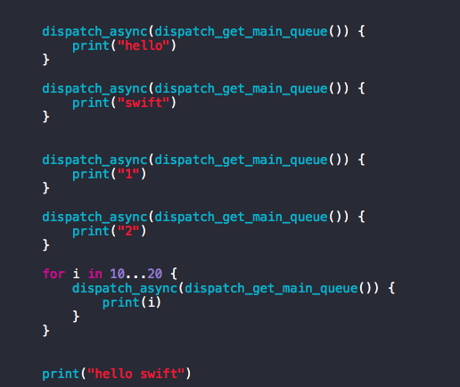
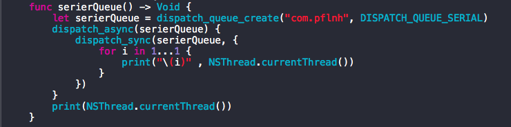

# 关于GCD的理解

一, dispatch_get_main_queue
1, 只有一个主线程, 只能用dispatch_async将任务添加到主线程, 用 dispatch_sync将会死锁
2, 用dispatch_async将任务添加到主线程后, 只有当前任务(方法)执行完后, 才会按照FIFO(先进先出)执行其他任务

print 如下: hello swift
hello
swift
1 2 10 11 12 13 14 15 16 17 18 19 20

二, dispatch_get_global_queue
1, 提供了四种全局队列: low, high, default, background, 一般默认选择default就够了
2, dispatch_sync不会堵塞线程,也不会开辟新的线程, 只会在当前线程, 按照FIFO将任务从队列(queue)中取出逐一执行
3, dispatch_async不会堵塞线程,根据cup实际情况会开辟新的线程, 按照FIFO将任务从队列(queue)中取出异步执行

三, 自定义队列
1, 并行队列

如上图, 堵塞了, 只能打印出主线程信息
最里层的打印被堵塞了, 里面的当前线程是一个同步线程, 在当前serierQueue队列堵塞了

