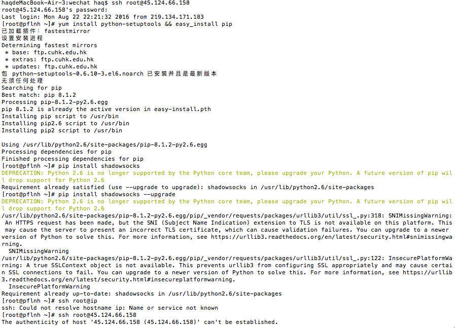
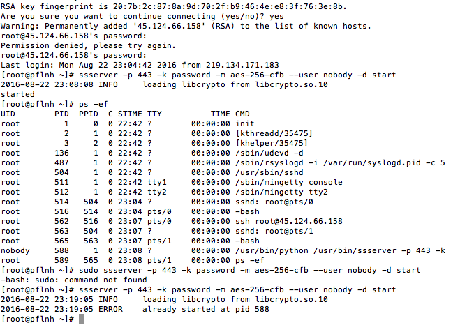

# vps 搭建shadowsocks
1, 生产公私钥: ssh-keygen -t rsa, 将产生的公钥上传服务器
2, 如果发现waring错误: 执行命令ssh-keygen -R ip
3, 启动远程服务:ssh root@ip
4, CentOS环境命令如下: 

	yum install python-setuptools && easy_install pip
	pip install shadowsocks
5, 在CentOS环境内执行:ssserver -p 443 -k password -m aes-256-cfb --user nobody -d start

	

	ps: 先ssh root@ip, 安装shadowsocks, 再ssh root@ip, 在root时候的密码, 再执行ssserver -p 443 -k password -m aes-256-cfb --user nobody -d start

