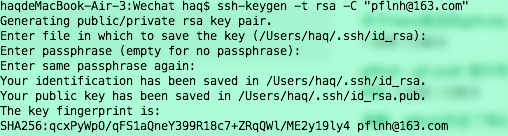
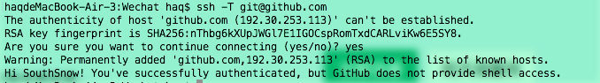

# 给github添加公钥
1, 设置user.name user.email
git config --global user.name '你的name'
git config --global user.email '你的邮箱'

2, 生成ssh秘钥
1), 查看是否有秘钥: cd ~/.ssh, 如果有清空
2), 生成秘钥: ssh-keygen -t rsa -C "你刚才设置的邮箱"
3), 三个回车键后

4), 添加秘钥到ssh: ssh-add ~/.ssh/id_rsa
5), 在github上添加公钥: 用命令: cat ~/.ssh/id_rsa.pub, 将会打印公钥于终端上, copy至github上即可
6), 测试是否成功: ssh -T git@github.com, 如果打印如下则成功了

