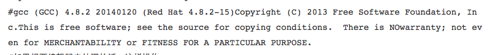

# Centos和PM2,VPS搭建nodejs服务器:
1, 环境介绍
	本地:MacOS, 应用采用的技术: nodejs和koa.js
	远程服务器: hostus(1核CPU), IP: 45.124.66.158, 系统为: Centos6.5
	Github: *********
2, 系统架构
	服务器部署node应用, 并在3000端口进行监听, 本地代码开发测试后, 更新到github, 然后通过pm2部署远程服务器
3, 服务器端安装必要的软件
	拟安装如下应用: Node, npm, pm2
	
				node安装过程:
				1), 下载源码包: wget https://nodejs.org/download/release/v4.5.0********, 
				2), 解压源码包: tar -xzvf node-v4.5.0*****
				3), cd node-v4.5.0
				4), ./configure
				 #检查编译环境, 低版本一般不会报错, 高版本容易出错,错误信息如下:
				 				此时查看当前gcc版本: gcc --version
				
				以下是解决方法, 解决方法, 解决方法:
				#创建一个开发工具下载目录:
				mkdir devtools
				#进入目录:
				cd devtools
				#工具 repo
				wget http://people.centos.org/tru/devtools-2/devtools-2.repo -O /etc/yum.repos.d/devtools-2.repo
				#下载完成后可以使用yum安装最新开发工具
				yum install devtoolset-2-gcc devtoolset-2 binutils devtoolset-2-gcc-c++ 
				#这个将安装的文件放在了
				/opt/rh/devtoolset-2
				#查看gcc版本 
				/opt/rh/devtoolset-2/root/usr/bin/gcc  --version 
				
				#如果想要编辑器去处理的话，这样操作
				export CC=/opt/rh/devtoolset-2/root/usr/bin/gcc
				export CPP=/opt/rh/devtoolset-2/root/usr/bin/cpp
				export CXX=/opt/rh/devtoolset-2/root/usr/bin/c++
				#如果你想要gcc替换本地的，当然不是真的去替换，只要把他放在				我们的/usrlocal/bin下面就好了，不必去管系统自带的
				ln -s /opt/rh/devtoolset-2/root/usr/bin/* /usr/local/bin/ 
				hash -r 
				gcc --version
				#和 /opt/rh/devtoolset-2/root/usr/bin/gcc  --version 一样了
				"/usr/local/bin/" ."usr/bin/"两个部分的路径,请看http://people.centos.org/				tru/devtools-2/readme 
				接下来编译重回node目录 :
				./configure
				#就没有错误提示了
				make && make install
				#待执行完成 
				hash -r
				node -v
				#更高版本node安装成功
				<以上解决方法感谢: http://bbs.lyarc.net/read-3273.html>

通过预留账号密码登录系统, 终端输入:
		ssh root@45.124.66.158
	更新软件:
		yum update -y	

		
		感谢作者:
		http://bbs.lyarc.net/read-3273.html

